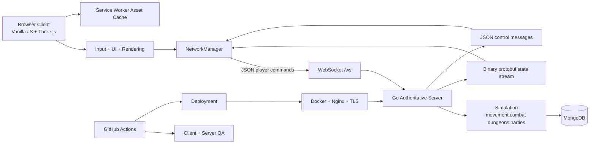

# The Accused - Shadow-Shinobi

A browser-based realtime multiplayer action RPG built and developed under the ChaseCraft / The Accused project.

This repository is the game core for **The Accused - Shadow-Shinobi**. The focus here is the game itself: a persistent online world with fast combat, character progression, dungeons, parties, trading, social systems, and a server-authoritative multiplayer runtime.

## What this repo is

The client is a vanilla JavaScript + Three.js browser game. The backend is an authoritative Go server that owns simulation, validation, networking, and persistence.

The important split is simple:

- the browser handles input, rendering, camera, HUD, menus, and presentation
- the server handles canonical movement, combat, abilities, rewards, dungeons, parties, reconnects, and saved state
- clients communicate over WebSockets
- MongoDB stores persistent character and social data
- protobuf state envelopes are used for efficient realtime replication

## Current Core

The existing core already gives us the heavy lifting we need for the game:

- realtime multiplayer gameplay
- four playable classes
- overworld realms and town
- instanced dungeons and boss encounters
- combat, abilities, movement, jumping, targeting, and rewards
- quests, progression, stash, forge, trading, friendships, and party systems
- reconnect and session-resume support
- client-side asset caching
- browser and server QA coverage
- Docker / MongoDB / Nginx deployment support

The job from here is not to keep inventing another engine. The job is to turn this core completely into **The Accused - Shadow-Shinobi** and then keep improving the actual game, world, visuals, combat feel, content, and assets.

## Project Direction

The game is being shaped around a darker ninja identity rather than the old placeholder world. The Shadow-Shinobi material is being carried into this core where it fits, while the existing multiplayer systems stay in place.

The game should feel like one coherent project rather than a collection of borrowed labels. Branding, UI copy, menus, lore text, developer notes, test names, and release material are being cleaned up as we move across the codebase.

## Architecture



## Main Runtime Areas

- `src/core/GameEngine.js` - main client runtime and state application
- `src/core/NetworkManager.js` - WebSocket lifecycle, commands, replication, reconnect, and resume
- `src/core/RenderSystem.js` - scenes, camera, rendering, and presentation
- `src/core/AbilityController.js` - local ability handling and targeting
- `server/main.go` - multiplayer transport and server runtime
- `server/internal/game/` - authoritative world simulation and gameplay rules
- `server/internal/database/` - persistence
- `server/deploy/` - deployment and server operations

## Local Development

### Requirements

- Node.js 24
- npm 9+
- Go 1.24.5
- MongoDB

### Start the server

From `server/`:

```bash
go run .
```

Default local endpoint:

```text
ws://localhost:8080/ws
```

### Start the client

From the repository root:

```bash
npm ci
npm run serve
```

Then open:

```text
http://127.0.0.1:4173
```

## Testing

Useful checks from the repository root:

```bash
npm test
npm run lint
npm run test:smoke
```

For browser end-to-end coverage:

```bash
npm run test:e2e
```

Server validation:

```bash
cd server
go test ./...
go build ./...
```

## Ownership / Project Voice

**The Accused - Shadow-Shinobi** is a ChaseCraft project by **Chase**.

The codebase is being maintained as a single game project with a consistent voice and naming scheme. Technical internals are kept stable where changing them would only create unnecessary breakage; player-facing material should belong to The Accused.
