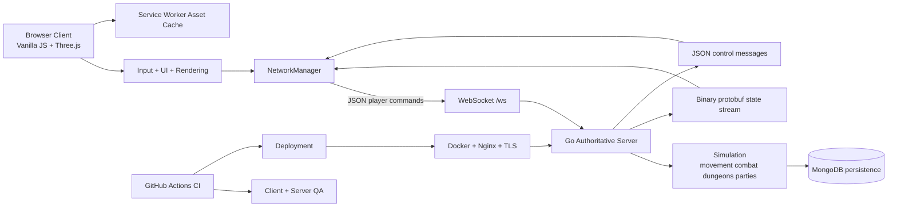

# The Accused — Shadow-Shinobi

[](https://github.com/ChaseChanceChange/The_Accused_shinobi/actions/workflows/ci.yml)

> **ChaseCraft / The Accused** — a persistent browser MMO/action RPG growing into **Shadow-Shinobi**.

## Overview

**The Accused — Shadow-Shinobi** is a browser-based realtime multiplayer action RPG / MMORPG being developed under the ChaseCraft / The Accused project.

The repository contains a substantial multiplayer game foundation and the engineering systems required to run it. The development work now turns that foundation into a distinct original shinobi game: new identity, world, story, terminology, combat presentation, progression, crafting, assets and content, while preserving the useful multiplayer/runtime architecture that already works.

The important split remains:

- the browser handles input, rendering, camera, HUD, menus, and presentation
- the server owns canonical movement, combat, abilities, rewards, dungeons, parties, reconnects, and saved state
- clients communicate over WebSockets
- the server streams state with protobuf `StateEnvelope` messages using the existing binary framing
- MongoDB backs persistent character and social data
- deployment includes Docker, MongoDB, Nginx, and TLS automation

**This is not a menu-only ninja manager.** The long-term target is a real explorable world in which players move, fight, loot, craft, travel, group up and progress.

For the current game decisions, see [the canonical Shadow-Shinobi game record](docs/THE-ACCUSED-SHADOW-SHINOBI.md).

---

## Game Identity

Shadow-Shinobi is being built as an original dark shinobi setting. The old placeholder game identity is being removed from player-facing content while useful engineering systems are retained and evolved.

Core direction:

- original ninja/shinobi worldbuilding
- dark, confident visual identity
- active and visually readable combat
- persistent MMO progression around the action
- rare equipment with individualised outcomes
- meaningful crafting risk and resource pressure
- difficult long-term progression for players chasing extreme/god-tier builds
- dungeons, raids, PvP, social systems and exploration that belong to one world
- responsive desktop and mobile presentation
- no pay-to-win progression model

The full canon, design rules and AI handoff guidance live in [docs/THE-ACCUSED-SHADOW-SHINOBI.md](docs/THE-ACCUSED-SHADOW-SHINOBI.md). Do not invent missing lore and treat it as established fact; add major decisions to that document instead.

---

## Engineering Focus

The technical foundation is a full-stack realtime game system:

- **Server-authoritative simulation:** movement, combat, abilities, dungeon progression, rewards, party flows and reconnect/session state are enforced on the Go server.
- **Realtime communication:** the browser sends player intent over WebSockets while the server streams canonical state back to connected clients.
- **Mixed protocol:** JSON commands/control messages plus binary protobuf state replication.
- **Synchronization:** client prediction/smoothing, remote-entity replication, reconnect/session resume and connection-state handling are already part of the architecture.
- **Persistence:** MongoDB stores long-lived character and social state.
- **Separation of concerns:** client presentation stays separate from server authority and gameplay validation.
- **Deployment:** Docker packaging, Compose, reverse-proxy/TLS tooling and release checks are included.
- **Verification:** Jest, ESLint, Playwright and Go tests/builds are supported, including disposable-character browser QA.

The guiding engineering rule is simple:

> **The browser expresses intent and presents the world. The server owns truth.**

---

## Current Foundation

The existing core provides the heavy lifting needed to continue building the game:

- realtime multiplayer action-RPG runtime
- four broad player combat archetypes in the current implementation
- overworld realms and town
- instanced dungeons and boss encounters
- movement, jumping, targeting and ability handling
- quests, progression and rewards
- equipment, stash and forge systems
- trading/auction functionality
- friendships, parties, guild/social features
- reconnect and session resume
- PvP/arena systems
- service-worker asset caching
- browser and server QA coverage
- Docker / MongoDB / Nginx deployment support

The purpose of the Shadow-Shinobi pass is not to throw this away and start another engine. It is to make the actual game built on this foundation recognisably **The Accused — Shadow-Shinobi**.

---

## Architecture



### Core runtime ownership

- `src/core/GameEngine.js` — main client runtime loop and authoritative state application.
- `src/core/NetworkManager.js` — WebSocket lifecycle, commands, protobuf decoding, reconnect and resume handling.
- `src/core/RenderSystem.js` — scenes, camera, rendering and visual presentation.
- `src/core/AbilityController.js` — local ability orchestration and targeting.
- `server/main.go` — WebSocket transport, message handling and state broadcast pipeline.
- `server/internal/game/world.go` — authoritative world simulation and gameplay rules.
- `server/internal/database/` — persistence layer.
- `server/deploy/` — deployment and operational scripts.

The browser sends actions such as movement, jump, attack, abilities and social commands. The server validates them, applies them to canonical state and republishes that state to connected clients.

---

## Tech Stack

| Layer | Technology |
|---|---|
| Client | Vanilla JavaScript ES modules, Three.js `0.181.2` |
| Networking | WebSockets |
| State protocol | JSON commands/control + protobuf `StateEnvelope` replication |
| Server | Go `1.24.5`, Gorilla WebSocket, protobuf |
| Persistence | MongoDB |
| Asset delivery | Static client files + service worker caching |
| Deployment | Docker, Docker Compose, Nginx, Certbot TLS scripts |
| Browser QA | Playwright `1.61.1`; system Chrome for credentialed gameplay and pinned Chromium for hosted anonymous CI |
| Validation | Jest, ESLint, Playwright, `go test`, `go build`, npm audit, GitHub Actions |

---

## Local Development

### Prerequisites

- Node.js `24` and npm `9+`
- Go `1.24.5`
- MongoDB

### Run the server

From `server/`:

```bash
go run .
```

Default local WebSocket endpoint:

```text
ws://localhost:8080/ws
```

### Run the client

From the repository root:

```bash
npm ci
npm run serve
```

Open:

```text
http://127.0.0.1:4173
```

For local gameplay against a local backend, use the repository's documented test/development server URL configuration rather than rewriting production assets.

### Local deployment path

From the server deployment directory/environment:

```bash
cp .env.example .env
docker compose build api
docker compose up -d
```

For Linux host deployment, see `server/deploy/README_LINUX.md`.

---

## Testing and Building

Client validation from the repository root:

```bash
npm ci
npm test
npm run lint
npm audit --audit-level=low
npm run docs:animations
npm run test:e2e:anonymous
```

Optional smoke subset:

```bash
npm run test:smoke
```

Full server validation from `server/`:

```bash
go test -race ./...
go build -trimpath ./...
```

### Browser QA

The repository contains a large set of browser checks covering UI, animation, movement, combat readability, inventories, menus, mobile layouts, multiplayer and isolated gameplay.

Useful suites include:

```bash
npm run test:e2e:animations
npm run test:e2e:movement
npm run test:e2e:multiplayer
npm run test:e2e:visual-load
```

The isolated character harness can create disposable API/Mongo resources and disposable allowlisted characters so progression and gameplay can be exercised without touching production data.

The anonymous route is intended for public-facing/browser presentation checks. Credentialed isolated routes are for real gameplay-state checks and deliberately avoid retaining user identifiers in Playwright artifacts.

### Fresh-progression QA

Fresh progression is intentionally measured separately from prepared-character functional QA.

Examples:

```bash
EIDOLON_ISOLATED_QA_ROUTE=fresh-opening EIDOLON_E2E_CLASS=Fighter npm run test:e2e:isolated
EIDOLON_ISOLATED_QA_ROUTE=fresh-collection EIDOLON_E2E_CLASS=Wizard npm run test:e2e:isolated
EIDOLON_ISOLATED_QA_ROUTE=fresh-hunt EIDOLON_E2E_CLASS=Wizard npm run test:e2e:isolated
EIDOLON_ISOLATED_QA_ROUTE=fresh-ready EIDOLON_E2E_CLASS=Wizard npm run test:e2e:isolated
EIDOLON_ISOLATED_QA_ROUTE=fresh-dungeon EIDOLON_E2E_CLASS=Wizard npm run test:e2e:isolated
```

These routes are legacy QA environment names for existing test infrastructure. They are not the player-facing game identity and should only be renamed later as part of a deliberate compatibility-safe test migration.

The routes create disposable level-one characters and earn progress through ordinary input rather than using level/item/quest/travel grants. Recorded evidence lives in `docs/plans/fresh-progression-evidence.md`.

### Other isolated regression routes

The QA harness also contains isolated checks for equipment recovery, talent economy, talent healing, talent duration, forge guidance, phone inventory, animation readiness and other focused gameplay behaviour.

For example:

```bash
EIDOLON_ISOLATED_QA_ROUTE=equipment-recovery npm run test:e2e:isolated
EIDOLON_ISOLATED_QA_ROUTE=talent-economy npm run test:e2e:isolated
EIDOLON_ISOLATED_QA_ROUTE=forge-guide npm run test:e2e:isolated
```

Do not delete these simply because the environment variable contains the old project name. The route names are part of working QA infrastructure and can be migrated deliberately once compatibility coverage exists.

`npm run audit:talent-consumers` is a diagnostic audit for still-open talent range/area consumers. Its known failures are tracked in `docs/plans/2026-09-06-talent-consumer-audit.md` and should not be misrepresented as a passing release gate.

---

## QA Environment and Resource-Safety Notes

The isolated harness deliberately checks for resource collisions and cleans only resources created by the current run.

Current local defaults include:

- Playwright static server: `4173`
- dedicated predeploy character gate: `41873`
- isolated API: `18185`
- CI isolated API: `18085`

Some local Linux workflows use host networking with an adjacent authenticated disposable Mongo instance to avoid Docker bridge/veth churn while a render-group browser check is running. Other hosts retain bridge mode, and the network mode can be explicitly selected by the existing QA configuration.

The project also contains checks for credential redaction and browser artifact safety. Credentialed traces/screenshots/video are disabled, and supplied credential values are scanned before upload. Anonymous browser checks may retain visual failure artifacts.

---

## Release Verification

The release system expects the deployed client/server identity to match the Git commit being released before live browser verification proceeds.

The exact production hostnames may change during the Shadow-Shinobi deployment transition; old deployment identifiers must not be presented as the current game identity.

Useful release documentation includes:

- `docs/art/FINAL_PROCEDURAL_CUTOVER_AUDIT.md`
- `docs/art/PROCEDURAL_MIGRATION_INVENTORY.md`
- `docs/plans/live-browser-qa-checklist.md`
- `docs/plans/fresh-progression-evidence.md`

Release-QA commands in the server may include `/level`, `/qa-waypoint`, `/qa-hazard`, `/qa-loot-next`, `/qa-disconnect`, `/qa-animation-ready` and `/qa-protection`. These are restricted test controls, not gameplay commands, and remain disabled unless the authenticated account is allowlisted by the server.

---

## Current Project State

The Shadow-Shinobi branch is an active transformation line rather than a cosmetic rename.

### Already established

- project identity: **The Accused — Shadow-Shinobi**
- canonical Shadow-Shinobi design/AI handoff document
- browser client + authoritative Go server foundation
- realtime multiplayer and persistence architecture
- existing dungeon, social, trading, progression and QA infrastructure
- deliberate separation between player-facing terminology and internal compatibility-sensitive identifiers

### In active development

- replacing old player-facing identity and placeholder world language
- carrying useful Shadow Shinobi systems/content into the newer realtime core
- defining the original world, factions, story, techniques and locations
- improving character presentation and visual combat feedback
- building the actual explorable world rather than stopping at menu/UI work
- integrating game assets in controlled batches with provenance tracking
- expanding crafting, rare individualised equipment and meaningful resource pressure
- shaping long-term progression, group content and endgame identity

### Verification rule

A documentation change is not evidence that gameplay has been implemented. Likewise, an existing engine feature is not automatically canon for Shadow-Shinobi until its player-facing meaning has been reviewed.

---

## Design Direction

The game should ultimately feel like a coherent world rather than a pile of systems.

### Combat

Combat must be active, readable and visually engaging: movement, targeting, attacks, ability effects, hit feedback, enemy telegraphs, damage readability, defensive choices, bosses with mechanics, and group roles all matter.

### Progression

Players should have meaningful decisions rather than a single obvious path. Resources are intentionally limited enough to create choices. Chasing the highest possible power should require commitment and should remain uncommon.

### Crafting

Rare equipment can carry individualised attributes and unusual combinations. High-end outcomes may carry real failure risk and meaningful material costs so that exceptional gear feels earned rather than manufactured on demand.

### Economy

The economy should reward activity, trade, exploration and decision-making without creating a direct pay-to-win power ladder.

### World

Players need somewhere to *go*. The eventual game should contain navigable settlements, routes, hazards, encounter spaces, dungeon interiors, boss arenas, gathering/exploration locations and environmental storytelling.

See the canonical game record for the detailed rules and open decisions.

---

## Media

Useful screenshots and visual evidence belong under `docs/media/` and should be updated as Shadow-Shinobi assets replace the temporary presentation.

Useful media targets include:

- overworld gameplay showing the current Shadow-Shinobi visual direction
- active combat showing targeting, effects and damage readability
- dungeon gameplay showing objectives, party state and rewards
- equipment/crafting screens showing rarity and risk clearly
- a short gameplay clip covering movement, combat, loot and menus

---

## Contributing / AI Development Rules

Before changing an existing system:

1. inspect the current implementation and tests
2. separate player-facing identity from technical contracts
3. preserve working internal IDs/protocols unless a migration is intended
4. check `docs/THE-ACCUSED-SHADOW-SHINOBI.md` before inventing lore or terminology
5. add important new decisions to the canonical record
6. run appropriate tests after meaningful implementation changes

Do **not** perform blind global search-and-replace on the old project name. Environment variables, protocol markers, storage keys, imports, migration names and test selectors can be compatibility-sensitive.

The goal is a genuinely evolving game with accumulated design memory — not a pile of renamed strings.

---

## Licensing and Asset Provenance

The codebase is open source according to the repository's licence files. External art, music, fonts, models and other assets must be checked separately for commercial-use compatibility and recorded with their provenance.

Temporary placeholder assets are acceptable. Untracked or ambiguous licensing is not.

---

## Canonical Documentation

The main design/identity record is:

- [The Accused — Shadow-Shinobi canonical game record](docs/THE-ACCUSED-SHADOW-SHINOBI.md)

That document records identity, design pillars, progression, crafting, combat direction, world requirements, story/lore rules, asset policy, AI authoring rules and the migration roadmap.
